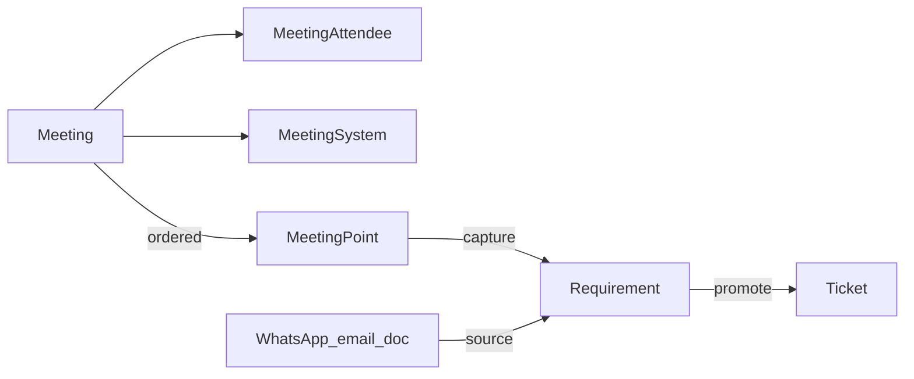

# Meetings & Requirements — Implementation Plan

**Status:** Approved — execute in phase order below.

Track CEO/project meetings, capture asks as **Requirements**, promote to **Tickets** (DRAFT — never bypass `PROGRAMMING_HEAD` approval per `req.md` §8/§21).

## Before coding

| Read | When |
|------|------|
| `req.md` §8, §16, §21 | Approval, permissions, non-negotiables |
| `backend/GUIDE.md` | Ticket flow, existing patterns |
| `backend/src/bugs/bug-promote.ts` | Promote-to-ticket shape |
| `backend/src/testing/testing.access.ts` | Scope service pattern |
| `.cursor/skills/barmijly-full-stack-feature/SKILL.md` | API + UI sync |
| `.cursor/skills/barmijly-prisma-migrate/SKILL.md` | Schema + migration |
| `.cursor/skills/barmijly-api-sync/SKILL.md` | Hooks ↔ endpoints |

Skills: `barmijly-full-stack-feature`, `barmijly-prisma-migrate`, `barmijly-api-sync`, `barmijly-patterns`.

**Execution:** Load skill `barmijly-full-stack-feature` and satisfy [`.cursor/rules/feature-standards.mdc`](.cursor/rules/feature-standards.mdc) + [`.cursor/rules/meetings-domain.mdc`](.cursor/rules/meetings-domain.mdc). Work through phases below in order.

---

## Domain model (four concepts)

| Concept | What it is | Lifecycle |
|---------|------------|-----------|
| **Meeting** | Event: when, where, who, company, linked systems | SCHEDULED → HELD / CANCELLED; archive only |
| **MeetingPoint** | One numbered minutes line (`order`, `kind`, `body`) | Lives on meeting page only — no status, no thread |
| **Requirement** | Tracked ask from any source | NEW → … → CONVERTED; archive only |
| **Ticket** | Implementation work | Unchanged; linked via `Ticket.requirementId` |

**Rule:** A minutes line that needs tracking is **captured** as a Requirement. Everything else stays a point. WhatsApp/email/doc asks are Requirements with `source` + `sourceNote`, no point.



### MeetingPoint kinds (`PointKind`)

- `NOTE` — narration («استعرض الرئيس التنفيذي أداء المبيعات»)
- `DECISION` — decision taken
- `RISK` — risk flagged
- `REQUEST` — ask that may be captured

### Requirement sources (`RequirementSource`)

`MEETING` · `WHATSAPP` · `EMAIL` · `DOCUMENT` · `CALL` · `OTHER`

Capturing a point always sets `source = MEETING` and `meetingPointId`.

---

## Non-negotiable

- No `BACKLOG` or new `TicketStatus` — Requirements are the backlog.
- Promote creates **DRAFT** ticket only (mirror `buildBugFixTicket`).
- Promote **refuses** without `systemId` on the requirement.
- Hard-delete nothing — `isArchived` only.
- Meetings: leadership-only read/manage (see matrix).
- INTERNAL comments hidden from `SYSTEM_OWNER` (existing `commentVisibilityWhere`).
- Unpinned requirements (`systemId: null`) invisible to non-leadership (`IN` excludes NULL).
- Every status change → `RequirementStatusHistory` + `AuditService.log`.
- Append deploy checkboxes to `to_migrate.md` when schema ships.

---

## Permissions

New actions in `backend/src/access/permissions.ts` and `frontend/src/lib/permissions.ts`:

| Action | Roles |
|--------|-------|
| `meeting:read` | PROGRAMMING_HEAD, PROJECT_MANAGER, SENIOR_MANAGEMENT |
| `meeting:manage` | PROGRAMMING_HEAD, PROJECT_MANAGER, SENIOR_MANAGEMENT |
| `requirement:read` | Above + DEVELOPER, QA, SYSTEM_OWNER (scoped) |
| `requirement:create` | PROGRAMMING_HEAD, PROJECT_MANAGER, SENIOR_MANAGEMENT |
| `requirement:triage` | PROGRAMMING_HEAD, PROJECT_MANAGER, SENIOR_MANAGEMENT |
| `requirement:promote` | PROGRAMMING_HEAD, PROJECT_MANAGER, SENIOR_MANAGEMENT |
| *(none)* | TICKET_REQUESTER — 403 all endpoints, no sidebar |

Points: no separate actions — minutes edit = `meeting:manage`; capture = `requirement:create`.

`SYSTEM_OWNER` does **not** get `requirement:create` (they use `ticket:create`).

---

## Schema (`backend/prisma/schema.prisma`)

### Enums

```prisma
enum MeetingType {
  CEO_REVIEW
  KICKOFF
  FOLLOW_UP
  DISCUSSION      // req.md §8 «تحويل لاجتماع نقاش»
  RETROSPECTIVE
  OTHER
}

enum MeetingStatus {
  SCHEDULED
  HELD
  CANCELLED
}

enum PointKind {
  NOTE
  DECISION
  RISK
  REQUEST
}

enum RequirementSource {
  MEETING
  WHATSAPP
  EMAIL
  DOCUMENT
  CALL
  OTHER
}

enum RequirementStatus {
  NEW
  UNDER_REVIEW
  ACCEPTED
  CONVERTED
  DECLINED
}
```

### Models (sketch)

**Meeting** — `meetingNumber` (autoincrement), `title`, `description` (agenda), `type`, `status`, `heldAt?`, `durationMins?`, `location?`, `companyId`, `organizerId`, `isArchived`, timestamps. **No `minutes` text field.**

**MeetingAttendee** — `meetingId`, optional `userId` (internal), optional `name` + `jobTitle` + `organization` (external CEO).

**MeetingSystem** — `@@id([meetingId, systemId])` join; “which systems this meeting covered”.

**MeetingPoint** — `meetingId`, `order`, `kind`, `body`, `raisedById?`, `raisedByName?`, timestamps. Thin — no status, no number.

**Requirement** — `requirementNumber`, `title`, `description?`, `source`, `sourceNote?`, `meetingPointId?`, `status`, `priority?`, `requestedById?`, `requestedByName?`, `ownerId?`, `dueDate?`, `systemId?`, `companyId`, `decidedById?`, `decidedAt?`, `decisionNote?`, `isArchived`, timestamps.

**RequirementStatusHistory** — mirror `BugStatusHistory`: `fromStatus?`, `toStatus`, `changedById`, `note?`, `createdAt`.

### Extensions to existing models

- `Ticket.requirementId String?` — one requirement, many tickets
- `TicketComment.ticketId` → nullable; add `requirementId String?`
- `TicketAttachment` — add `meetingId?`, `requirementId?`
- `Notification` — add `requirementId?`; new types `REQUIREMENT_RAISED`, `REQUIREMENT_ASSIGNED`

Migration name suggestion: `meetings_and_requirements`.

---

## Phase 1 — Schema & permissions

- [x] Add enums + models above; wire relations on `Company`, `System`, `User`
- [x] `cd backend && npx prisma migrate dev --name meetings_and_requirements`
- [x] `npx prisma generate`
- [x] Add six actions to `permissions.ts`; update `permissions.spec.ts`
- [x] Mirror `Action` union in `frontend/src/lib/permissions.ts`
- [x] Append to `to_migrate.md`:
  - [x] `cd backend && npx prisma migrate deploy`
  - [x] Deploy order: DB migrate → backend → frontend

---

## Phase 2 — Access layer

Create `backend/src/meetings/meetings.access.ts` (or `meetings/meeting-access.service.ts`) mirroring `testing.access.ts`:

- [x] `meetingScope(user)` — `companyId in visibleCompanyIds`; leadership only via action gate
- [x] `requirementScope(user)` — leadership: company filter; others: `{ systemId: { in: visibleSystemIds } }`
- [x] `loadVisibleMeeting(id, user)` — 404 / 403 split
- [x] `loadVisibleRequirement(id, user)` — 404 / 403 split
- [x] Specs: TICKET_REQUESTER 403; SYSTEM_OWNER cannot see `systemId: null` requirement

---

## Phase 3 — Meetings API

Module: `backend/src/meetings/` (`meetings.module.ts`, `meetings.controller.ts`, `meetings.service.ts`, `dto/`).

| Method | Path | Action | Notes |
|--------|------|--------|-------|
| GET | `/meetings` | `meeting:read` | Filter company, status, type, archived |
| POST | `/meetings` | `meeting:manage` | |
| GET | `/meetings/:id` | `meeting:read` | Include attendees, systems, points (ordered), attachments |
| PATCH | `/meetings/:id` | `meeting:manage` | |
| POST | `/meetings/:id/hold` | `meeting:manage` | → HELD |
| POST | `/meetings/:id/cancel` | `meeting:manage` | → CANCELLED |
| POST | `/meetings/:id/archive` | `meeting:manage` | |
| POST | `/meetings/:id/attendees` | `meeting:manage` | Internal or external |
| DELETE | `/meetings/:id/attendees/:attendeeId` | `meeting:manage` | |
| PUT | `/meetings/:id/systems` | `meeting:manage` | Replace `MeetingSystem` set |
| POST | `/meetings/:id/points` | `meeting:manage` | Append line; set `order` |
| PATCH | `/meetings/:id/points/:pointId` | `meeting:manage` | Edit body/kind |
| POST | `/meetings/:id/points/reorder` | `meeting:manage` | Contiguous rebalance (see `steps.service`) |
| DELETE | `/meetings/:id/points/:pointId` | `meeting:manage` | Rebalance after delete |
| POST | `/meetings/:id/points/:pointId/capture` | `requirement:create` | Create Requirement, link `meetingPointId`, `source=MEETING` |

Every mutation → `AuditService.log({ entity: 'Meeting' | 'MeetingPoint', ... })`.

- [x] `meetings.service.spec.ts` — scope, capture, reorder

---

## Phase 4 — Requirements API

Module: `backend/src/requirements/`.

| Method | Path | Action | Notes |
|--------|------|--------|-------|
| GET | `/requirements` | `requirement:read` | Filters: status, source, company, system, archived |
| POST | `/requirements` | `requirement:create` | Standalone (WhatsApp, etc.) |
| GET | `/requirements/:id` | `requirement:read` | Embed comments (visibility filter), attachments, status history, linked tickets |
| PATCH | `/requirements/:id` | `requirement:triage` | Owner, system, priority, due, title/body |
| POST | `/requirements/:id/status` | `requirement:triage` | → `RequirementStatusHistory` |
| POST | `/requirements/:id/archive` | `requirement:triage` | |
| POST | `/requirements/:id/promote` | `requirement:promote` | See promote section |
| POST | `/requirements/:id/comments` | `comment:create` | After comments generalization |
| PATCH | `/requirements/:id/comments/:id` | author | |
| DELETE | `/requirements/:id/comments/:id` | author | |

- [x] `requirement-promote.ts` — pure `buildRequirementTicket()` like `bug-promote.ts`
- [x] `requirements.service.spec.ts` — promote gate, scope, status history

### Promote checklist (`POST /requirements/:id/promote`)

1. `requirement:promote` + scope
2. Refuse if no `systemId`
3. Create `Ticket` — `DRAFT`, type from context (default `NEW_FEATURE` or `MODIFICATION`), scope from requirement
4. Set `Ticket.requirementId`
5. Requirement → `CONVERTED`
6. `AuditService.log` on requirement and ticket
7. Notification to owner if set

---

## Phase 5 — Comments & attachments

### Comments (`backend/src/comments/`)

- [x] `resolveParent({ ticketId?, requirementId? })` → scope ref, notify target, URL
- [x] `TicketComment.ticketId` nullable; `requirementId` FK
- [x] Routes: keep `/tickets/:id/comments`; add `/requirements/:id/comments`
- [x] Requirement `findOne` embeds comments with `commentVisibilityWhere(user)`
- [x] `filterMentionable` — nullable `systemId` on scope ref
- [x] `UsersService.getUserComments` — null-guard when `ticketId` null

### Attachments (`backend/src/attachments/`)

- [x] Extend `AttachmentOwnerRef` with `meetingId`, `requirementId`
- [x] `assertCanReach` — company-scope branch via `MeetingAccessService`
- [x] Upload query params on controller

- [x] `comments.access.spec.ts` / attachment specs for requirement parent

---

## Phase 6 — Notifications

- [x] `Notification.requirementId` + enum values
- [x] Extend `NotificationsService.scopedWhere` — do **not** let `ticketId: null` bypass requirement scope
- [x] Fire `REQUIREMENT_RAISED` / `REQUIREMENT_ASSIGNED` on create/triage assign

---

## Phase 7 — Frontend

### Nav & routes

- [x] Sidebar: «الاجتماعات» (`meeting:read`), «المتطلبات» (`requirement:read`)
- [x] `/meetings`, `/meetings/[id]`, `/requirements`, `/requirements/[id]`
- [x] `useMeetings.ts`, `useRequirements.ts` — mirror `useBugs.ts`
- [x] Labels in `frontend/src/lib/constants.ts` (RTL Arabic)
- [x] `qk` entries in `query-keys.ts`

### Meetings UI

- [x] List: company filter, status chips, empty state
- [x] Detail: header (type, date, location, organizer), attendee editor (internal picker + external fields), system chips (`MeetingSystem`), **numbered points list** (pattern: `OrderedStepList`), capture button per line → requirement chip, meeting-level attachments (`FilePickArea`)
- [x] `*.test.tsx` for list + detail; 360px + `lg`

### Requirements UI

- [x] Extract `useComments({ kind, id })` from `useTickets.ts`
- [x] Reparent `CommentThread` — upload URL + cache key from parent ref
- [x] Backlog list: status, source, company filters
- [x] Detail: triage fields, status control, origin strip (meeting point link or source note), `CommentThread`, attachments, «إنشاء تذكرة» promote
- [x] Ticket detail: show linked requirement when `requirementId` set (optional polish)
- [x] Regression tests on ticket comment thread

---

## Phase 8 — Docs & register

- [x] `backend/GUIDE.md` — document all endpoints
- [x] `.cursor/uncommitted.md` — one Feature line when shipping

---

## Patterns to copy

| Need | Copy from |
|------|-----------|
| Promote to DRAFT ticket | `backend/src/bugs/bug-promote.ts`, `bugs.service` promote |
| Scope service | `backend/src/testing/testing.access.ts` |
| Status history | `BugStatusHistory` + `bugs.service` status change |
| Ordered rows + reorder | `backend/src/testing/steps.service.ts`, `OrderedStepList.tsx` |
| List + detail hooks | `frontend/src/hooks/useBugs.ts` |
| Attachment owner union | `frontend/src/lib/attachments.ts` |

---

## Verification

```bash
cd backend && npm test
cd frontend && npm test
cd backend && npm run start:dev   # Swagger /api/docs
```

Manual: leadership creates meeting → adds points → captures REQUEST → triages system → promotes → ticket is DRAFT → normal approval flow.

---

## Open decisions (resolved — do not revisit)

- Meeting scoped to **one company**, **many systems** (`MeetingSystem` join).
- Minutes = **ordered MeetingPoint rows** only (no free-text `minutes` field).
- **MeetingPoint** light; **Requirement** tracked; capture links `meetingPointId`.
- One point → many requirements (`Requirement.meetingPointId`); re-raised topic = new point on later meeting.
- Comments/attachments on **Requirement** and meeting-level attachments only.
